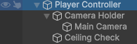
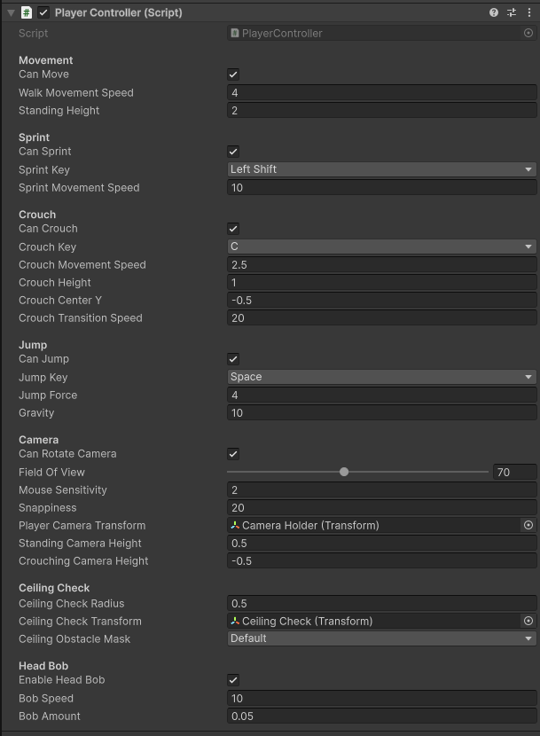

# Unity Player Controller

A modular first-person player controller for Unity with movement, sprinting, crouching, jumping, camera control, ceiling detection and head bob.

## Preview


## Features

* First-person movement
* Walking
* Sprinting
* Crouching
* Jumping
* Gravity
* Smooth camera rotation
* Field of view control
* Head bob
* Ceiling detection
* Smooth crouch transitions
* Runtime movement control
* Runtime camera control
* Runtime sprint, crouch and jump control
* Unity Inspector configuration


## Requirements

* Unity 2022.3 LTS or newer
* Character Controller (Added automaticly)
* Input Manager (Legacy Input System)

## Installation

1. Download or clone this repository.
2. Copy the `PlayerController` folder into your Unity project's `Assets` folder.

## Setup

1. Create an empty GameObject in the scene and name it `Player Controller` or `Player`.<br>

<br>

2. Create two empty child GameObjects and name them `Camera Holder` and `Ceiling Check`.<br>
3. Add a Camera as a child of Camera Holder.<br>
4. Create a LayerMask and assign the layers that should be detected as ceiling obstacles.<br>
5. Assign the required objects and LayerMask in the Inspector.<br>

The `Ceiling Check transform` should be placed above the player's head and used to detect obstacles when standing up from a crouch.<br>

<br>


## Controls

| Action | Key        |
| ------ | ---------- |
| Move   | WASD/Arrows|
| Look   | Mouse      |
| Sprint | Left Shift |
| Crouch | C          |
| Jump   | Space      |

## Configuration

The controller can be configured directly from the Unity Inspector.

### Movement

* Walk Movement Speed
* Sprint Movement Speed
* Crouch Movement Speed

### Crouch

* Crouch Height
* Crouch Center
* Crouch Transition Speed
* Camera Height

### Jump

* Jump Force
* Gravity

### Camera

* Field of View
* Mouse Sensitivity
* Camera Snappiness

### Head Bob

* Enable / Disable
* Bob Speed
* Bob Amount

### Ceiling Detection

* Ceiling Check Transform
* Ceiling Check Radius
* Obstacle Layer Mask

## Runtime API

Movement, camera rotation and individual movement abilities can be controlled from other scripts.

```csharp
PlayerController.Instance.SetMovementEnabled(false);
PlayerController.Instance.SetCameraRotationEnabled(false);
PlayerController.Instance.SetSprintEnabled(false);
PlayerController.Instance.SetCrouchEnabled(false);
PlayerController.Instance.SetJumpEnabled(false);
```

For example, to temporarily disable player movement:

```csharp
PlayerController.Instance.SetMovementEnabled(false);
```

And enable it again:

```csharp
PlayerController.Instance.SetMovementEnabled(true);
```


## License

This project is licensed under the MIT License.

See the `LICENSE` file for more information.

## Author

Created by **heartindiesel**.
